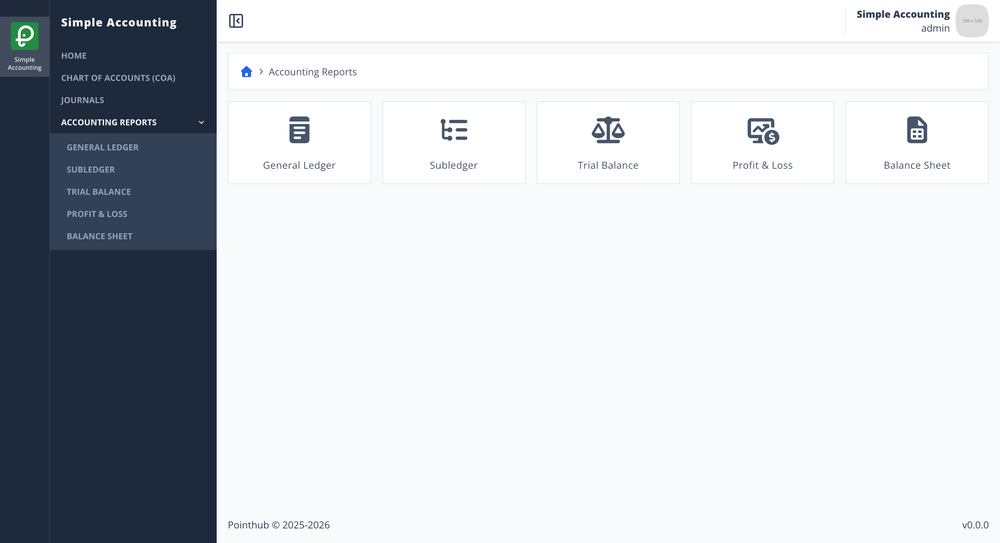
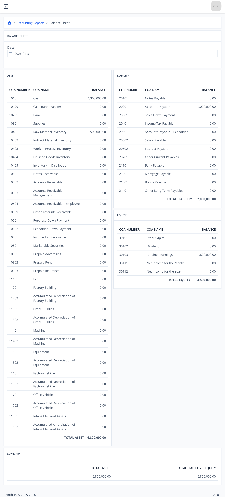

# Scenario 5.5. Balance Sheet

## Scenarios

- **Success Scenarios**
  - [**5.5.S1 Filtered report.**](/accounting-reports/balance-sheet/scenarios/s1)
- **Failure Scenarios**
  - [5.5.F1 User isn't authenticated.](/accounting-reports/balance-sheet/scenarios/f1)

## 5.5.S1 Filtered report.

- `GIVEN` user already logged in
- `AND` user visit home
- `WHEN` user click menu "Accounting Reports"

{.shadow-img}

- `AND` user click menu "Balance Sheet"

{.shadow-img}

- `THEN` user see "TOTAL ASSET" is "6,800,000.00"
- `AND` user see "TOTAL LIABILITY" is "2,000,000.00"
- `AND` user see "TOTAL EQUITY" is "4,800,000.00"
- `AND` user see "TOTAL LIABILITY + EQUITY" is "6,800,000.00"

{.shadow-img}