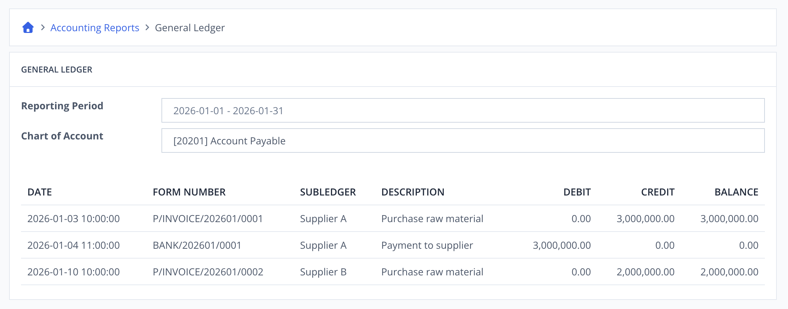

# Scenario 5.1. General Ledger

## Scenarios

- **Success Scenarios**
  - [**5.1.S1 Filtered report.**](/accounting-reports/general-ledger/scenarios/s1)
- **Failure Scenarios**
  - [5.1.F1 User isn't authenticated.](/accounting-reports/general-ledger/scenarios/f1)

## 5.1.S1 Filtered report.

- `GIVEN` user already logged in
- `AND` user visit home
- `WHEN` user click menu "Accounting Reports"
- `AND` user click menu "General Ledger"

{.shadow-img}

- `THEN` user see "DATE" header
- `AND` user see "FORM NUMBER" header
- `AND` user see "SUBLEDGER" header
- `AND` user see "DESCRIPTION" header
- `AND` user see "DEBIT" header
- `AND` user see "CREDIT" header
- `AND` user see "BALANCE" header

{.shadow-img}