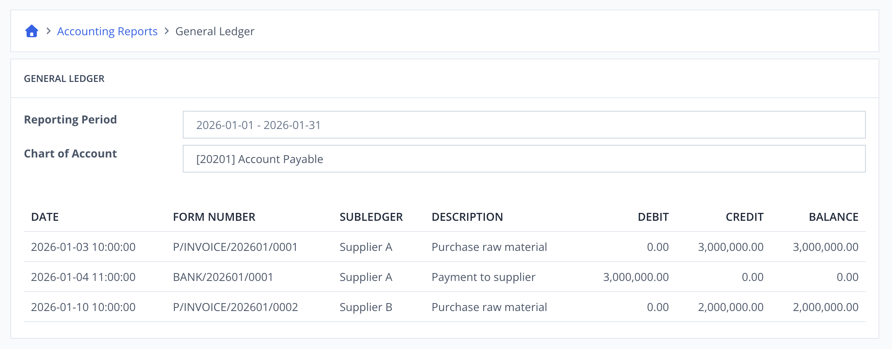

# Scenario 5.1. General Ledger

## 5.1.S1. User can view filtered general ledger report.

- `GIVEN` user already logged in
- `AND` user visit home
- `WHEN` user click menu "Accounting Reports"

{.shadow-img}

- `AND` user click menu "General Ledger"

{.shadow-img}

- `THEN` user see "DATE" header
- `AND` user see "FORM NUMBER" header
- `AND` user see "SUBLEDGER" header
- `AND` user see "DESCRIPTION" header
- `AND` user see "DEBIT" header
- `AND` user see "CREDIT" header
- `AND` user see "BALANCE" header

{.shadow-img}