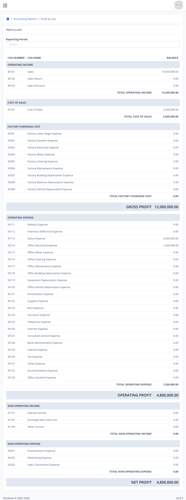

# Scenario 5.4. Profit & Loss

## Scenarios

- **Success Scenarios**
  - [**5.4.S1 Filtered report.**](/accounting-reports/profit-and-loss/scenarios/s1)
- **Failure Scenarios**
  - [5.4.F1 User isn't authenticated.](/accounting-reports/profit-and-loss/scenarios/f1)

## 5.4.S1 Filtered report.

- `GIVEN` user already logged in
- `AND` user visit home
- `WHEN` user click menu "Accounting Reports"

{.shadow-img}

- `AND` user click menu "Profit & Loss"

{.shadow-img}

- `THEN` user see "NET PROFIT" is "4,800,000.00"

{.shadow-img}