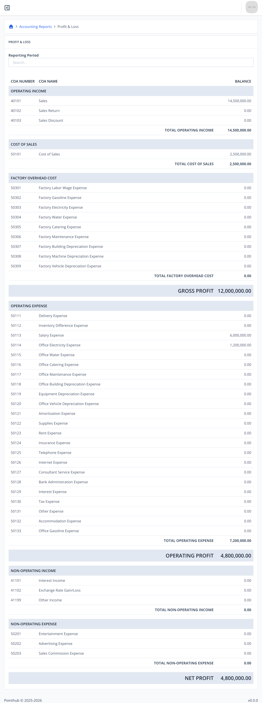

# Scenario 5.4. Profit & Loss

## 5.4.S1. User can view filtered profit and loss report.

- `GIVEN` user already logged in
- `AND` user visit home
- `WHEN` user click menu "Accounting Reports"

{.shadow-img}

- `AND` user click menu "Profit & Loss"

{.shadow-img}

- `THEN` user see "NET PROFIT" is "4,800,000.00"

{.shadow-img}