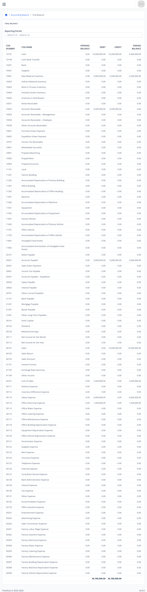

# Scenario 5.3. Trial Balance

## 5.3.S1. User can view filtered trial balance report.

- `GIVEN` user already logged in
- `AND` user visit home
- `WHEN` user click menu "Accounting Reports"

{.shadow-img}

- `AND` user click menu "Trial Balance"

{.shadow-img}

- `THEN` user see "DATE" header
- `AND` user see "COA NUMBER" header
- `AND` user see "COA NAME" header
- `AND` user see "OPENING BALANCE" header
- `AND` user see "DEBIT" header
- `AND` user see "CREDIT" header
- `AND` user see "ENDING BALANCE" header

{.shadow-img}