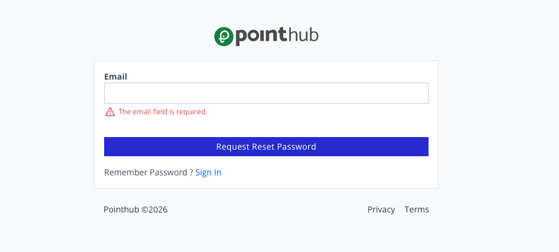

# Scenario 1.5. Forgot Password

## 1.5.F1. Password reset request fails when required fields are empty.

- `GIVEN` user visit `/signin`
- `WHEN` user click button "forgot-password"

{.shadow-img}

- `WHEN` user click button "request-reset-password"

- `THEN` user see "The email field is required.".

{.shadow-img}