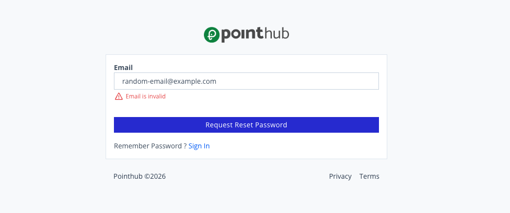

# Scenario 1.5. Forgot Password

## 1.5.F2. Password reset request fails when email is not found.

- `GIVEN` user visit `/signin`
- `WHEN` user click button "forgot-password"

{.shadow-img}

- `WHEN` user type "random-email@example.com" into input "email"
- `AND` user click button "request-reset-password"
- `THEN` user see "Email is invalid.".

{.shadow-img}