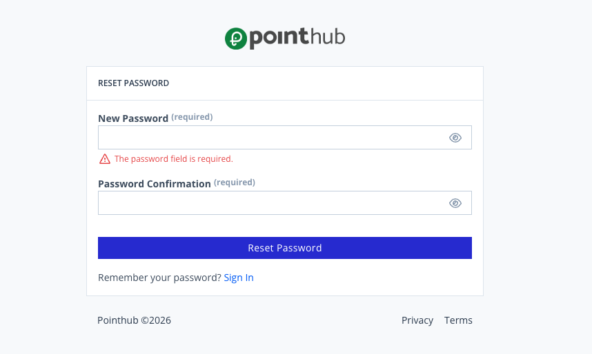

# Scenario 1.6. Reset Password

## 1.6.F1. Password reset fails when required fields are empty.

- `GIVEN` user receive an email
- `WHEN` user click button "reset-password"

{.shadow-img}

- `WHEN` user click button "reset-password"
- `THEN` user see "The password field is required.".

{.shadow-img}