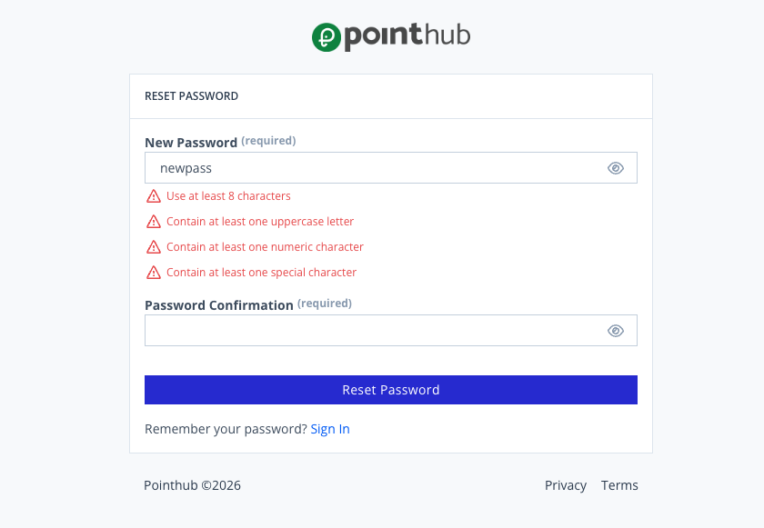

# Scenario 1.6. Reset Password

## 1.6.F2. Password reset fails when password is not strong enough.

- `GIVEN` user receive an email
- `WHEN` user click button "reset-password"

{.shadow-img}

- `WHEN` user type "newpass" into input "new-password"
- `AND` user click button "reset-password"
- `THEN` user see "Use at least 8 characters".
- `AND` user see "Contain at least one uppercase letter".
- `AND` user see "Contain at least one numeric character".
- `AND` user see "Contain at least one special character".

{.shadow-img}