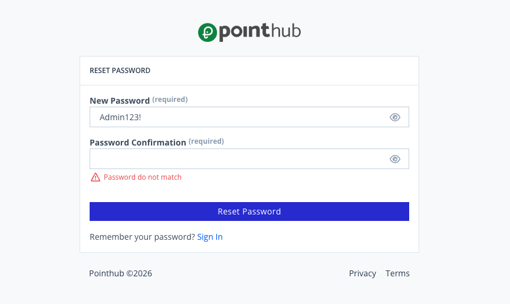

# Scenario 1.6. Reset Password

## 1.6.F3. Password reset fails when password confirmation does not match.

- `GIVEN` user receive an email
- `WHEN` user click button "reset-password"

{.shadow-img}

- `WHEN` user type "Admin123!" into input "new-password"
- `AND` user click button "reset-password"
- `THEN` user see "Password do not match".

{.shadow-img}