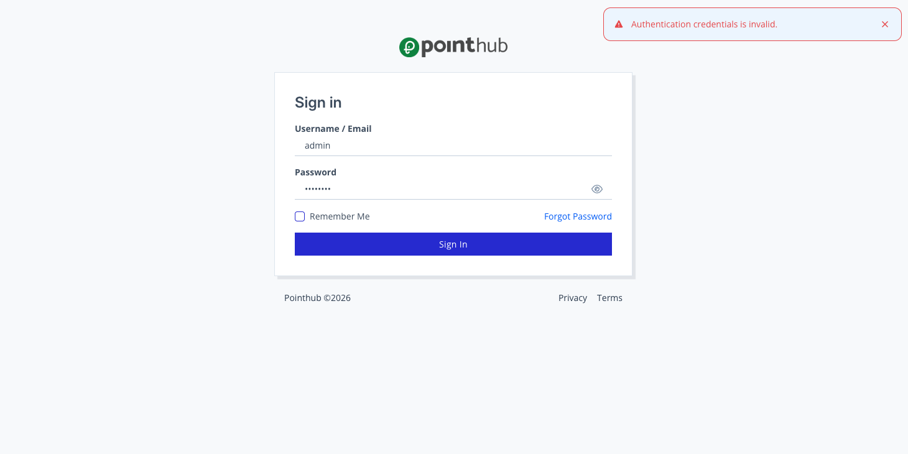

# Scenario 1.3. Signin

## 1.3.F1. Sign in fails when credentials do not match.

- `GIVEN` user visit `/signin`

{.shadow-img}

- `WHEN` user type "admin" into input "username"
- `AND` user type "12345678" into input "password"
- `AND` user click button "sign-in"
- `THEN` user see "Authentication credentials is invalid".

{.shadow-img}