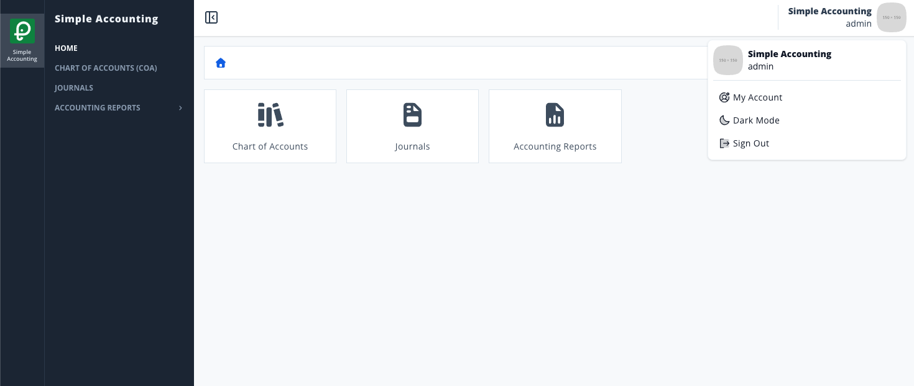

# Scenario 1.4. Signout

## 1.4.S1. User can sign out successfully.

- `GIVEN` user already logged in
- `AND` user visit home

{.shadow-img}

- `WHEN` user click account menu in top-right corner
- `AND` user click button "signout"

{.shadow-img}

- `THEN` user redirected to page "signin"

{.shadow-img}