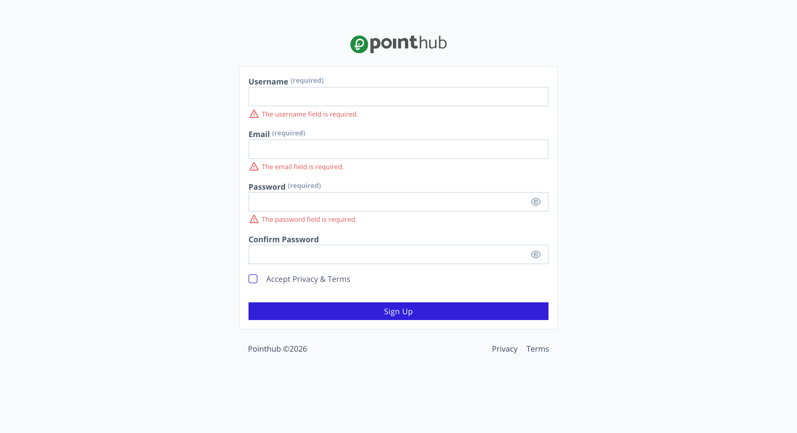

# Scenario 1.1. Signup

## Scenarios

- **Success Scenarios**
  - [1.1.S1. User successfully signup.](/auth/signup/scenarios/s1)
- **Failure Scenarios**
  - [**1.1.F1. The required fields is empty.**](/auth/signup/scenarios/f1)
  - [1.1.F2. The username is already exists.](/auth/signup/scenarios/f2)
  - [1.1.F3. The email is already exists.](/auth/signup/scenarios/f3)
  - [1.1.F4. Password is not strong enough.](/auth/signup/scenarios/f4)
  - [1.1.F5. Password confirmation is not match.](/auth/signup/scenarios/f5)

## 1.1.F1 The required fields is empty

- `GIVEN` user visit signup page
- `WHEN` user click button "sign-up"

{.shadow-img}

- `THEN` user see "The username field is required"
- `AND` user see "The email field is required"
- `AND` user see "The password field is required"

{.shadow-img}

