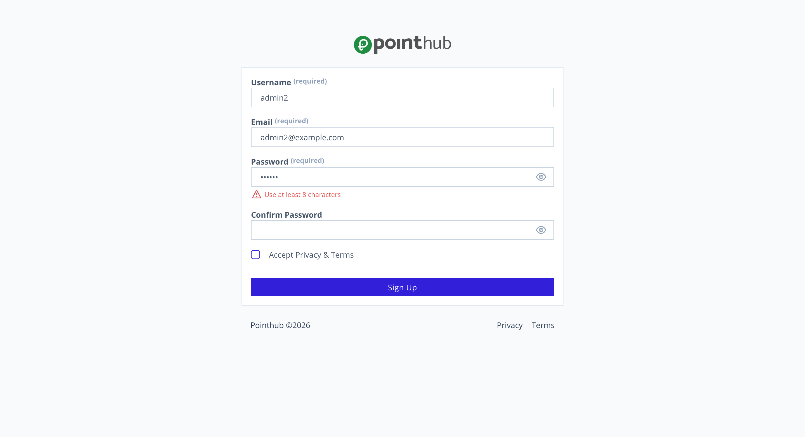

# Scenario 1.1. Signup

## 1.1.F4. Sign up fails when password is not strong enough.

- `GIVEN` user visit signup page

{.shadow-img}

- `WHEN` user type "admin2" into input "username"
- `AND` user type "admin2@example.com" into input "email"
- `AND` user type "admin" into input "password"
- `THEN` user see "Use at least 8 characters"

{.shadow-img}

