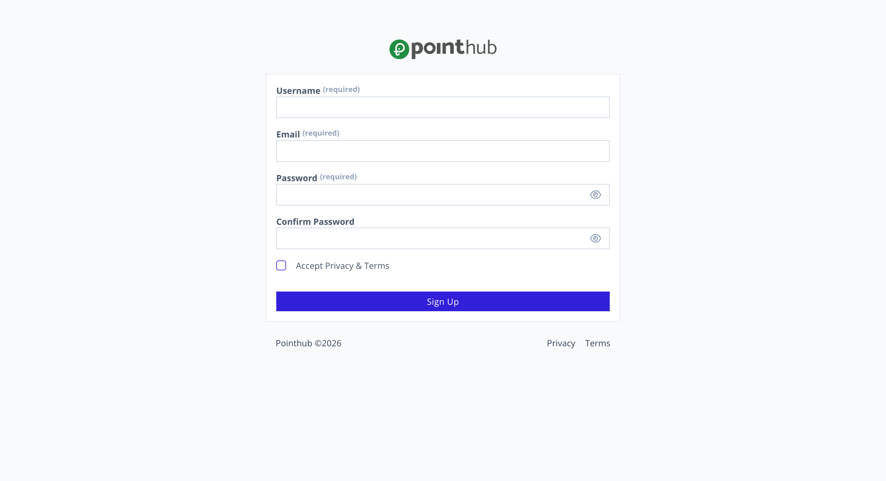
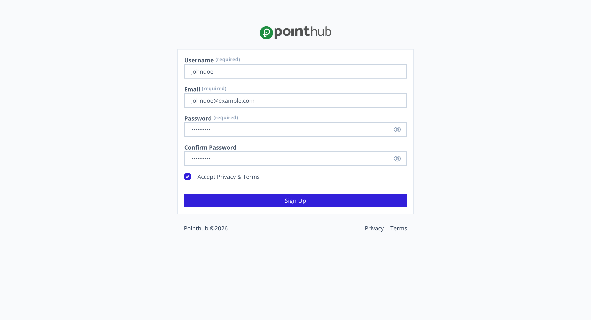
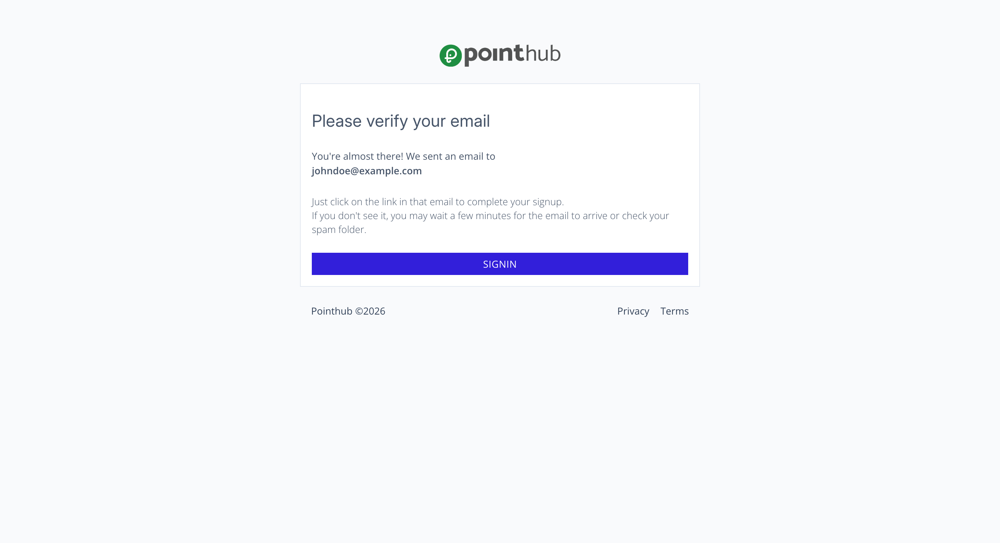
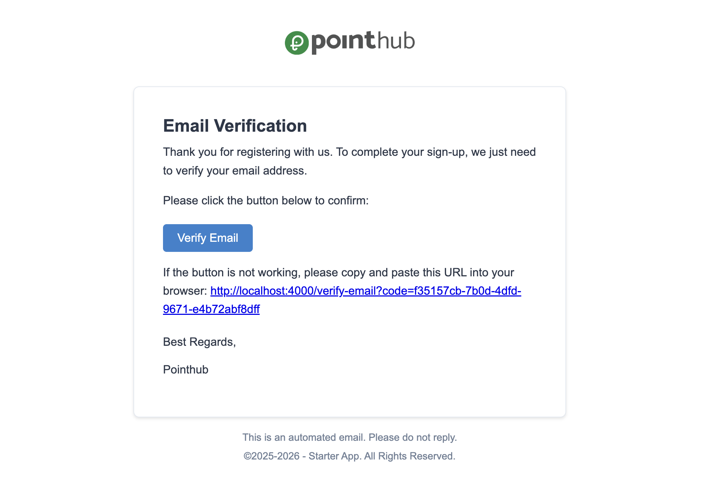

# Scenario 1.1. Signup

## Scenarios

- **Success Scenarios**
  - [**1.1.S1. User successfully signup.**](/auth/signup/scenarios/s1)
- **Failure Scenarios**
  - [1.1.F1. The required fields is empty.](/auth/signup/scenarios/f1)
  - [1.1.F2. The username is already exists.](/auth/signup/scenarios/f2)
  - [1.1.F3. The email is already exists.](/auth/signup/scenarios/f3)
  - [1.1.F4. Password is not strong enough.](/auth/signup/scenarios/f4)
  - [1.1.F5. Password confirmation is not match.](/auth/signup/scenarios/f5)

## 1.1.S1 User successfully signup

- `GIVEN` user visit signup page

{.shadow-img}

- `WHEN` user type "johndoe" into input "username"
- `AND` user type "johndoe@example.com" into input "email"
- `AND` user type "John1234" into input "password"
- `AND` user type "John1234" into input "confirm-password"
- `AND` user click checkbox "accept-terms-and-privacy"
- `AND` user click button "sign-up"

{.shadow-img}

- `THEN` user see "Please verify your email"
- `AND` user see "You're almost there! We sent an email to johndoe@example.com"
- `AND` user see "Just click on the link in that email to complete your signup."
- `AND` user see "If you don't see it, you may wait a few minutes for the email to arrive or check your spam folder."

:::info Message
Please verify your email
You're almost there! We sent an email to johndoe@example.com

Just click on the link in that email to complete your signup.
If you don't see it, you may wait a few minutes for the email to arrive or check your spam folder.
:::

{.shadow-img}

`THEN` user receive an email to verify email.

:::info
**Subject:**

Please verify your email address

**Body:**

Email Verification
Thank you for registering with us. To complete your sign-up, we just need to verify your email address.

Please click the button below to confirm:

[Verify Email](http://localhost:4000/verify-email?code=f35157cb-7b0d-4dfd-9671-e4b72abf8dff)

If the button is not working, please copy and paste this URL into your browser: http://localhost:4000/verify-email?code=f35157cb-7b0d-4dfd-9671-e4b72abf8dff

Best Regards,

Pointhub
:::
{.shadow-img}

## Database Changes

Before Signup

```ts
const users = []
```

After Signup

```ts
const users = [
  {
    _id: "69ae0dabf12cfd6a5dd090eb",
    username: "johndoe",
    email: "johndoe@example.com",
    password: "$argon2id$v=19$m=65536,t=2,p=1$7M8Lw...", // encrypted from "John1234"
    email_verification: {
      is_verified: false,
      requested_at: "2026-03-09T00:00:42.734Z",
      code: "ae59ee4b-3221-4cbe-8fd5-144fa126a102",
      url: "https://simple-accounting.pointhub.app/verify-email"
    },
    created_at: "2026-03-09T00:00:43.411Z",
    trimmed_email: "janedoe@example.com", // auto generate
    trimmed_username: "janedoe" // auto generate
  }
]
```