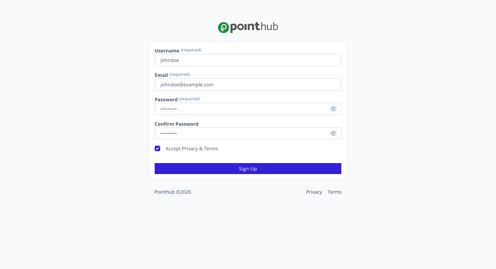
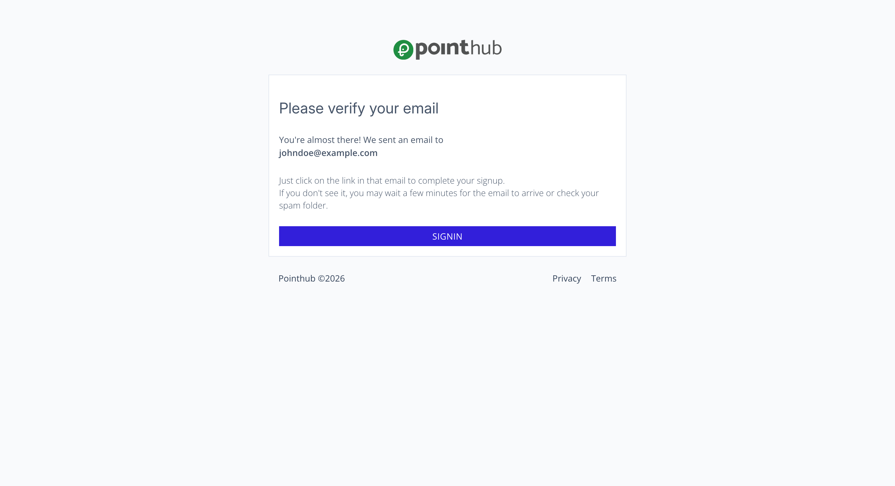
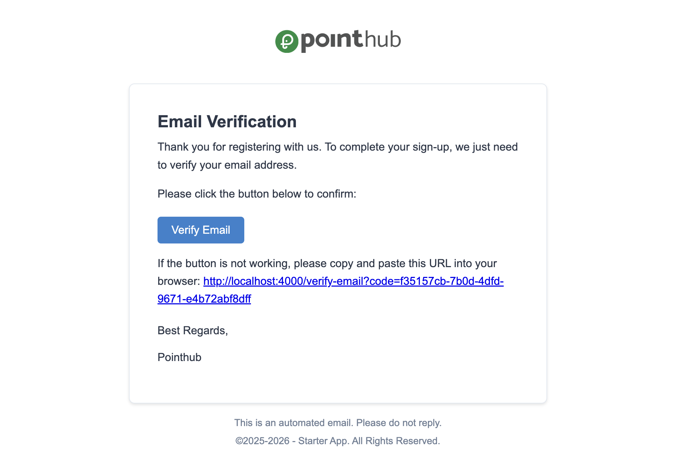

# Scenario 1.1. Signup

## 1.1.S1. User can sign up successfully.

- `GIVEN` user visit signup page

{.shadow-img}

- `WHEN` user type "johndoe" into input "username"
- `AND` user type "johndoe@example.com" into input "email"
- `AND` user type "John1234" into input "password"
- `AND` user type "John1234" into input "confirm-password"
- `AND` user click checkbox "accept-terms-and-privacy"
- `AND` user click button "sign-up"

{.shadow-img}

- `THEN` user see "Please verify your email"
- `AND` user see "You're almost there! We sent an email to johndoe@example.com"
- `AND` user see "Just click on the link in that email to complete your signup."
- `AND` user see "If you don't see it, you may wait a few minutes for the email to arrive or check your spam folder."

:::info Message
Please verify your email
You're almost there! We sent an email to johndoe@example.com

Just click on the link in that email to complete your signup.
If you don't see it, you may wait a few minutes for the email to arrive or check your spam folder.
:::

{.shadow-img}

`THEN` user receive an email to verify email.

:::info
**Subject:**

Please verify your email address

**Body:**

Email Verification
Thank you for registering with us. To complete your sign-up, we just need to verify your email address.

Please click the button below to confirm:

Verify Email

If the button is not working, please copy and paste this URL into your browser: https://simple-accounting.pointhub.app/verify-email?code=f35157cb-7b0d-4dfd-9671-e4b72abf8dff

Best Regards,

Pointhub
:::
{.shadow-img}