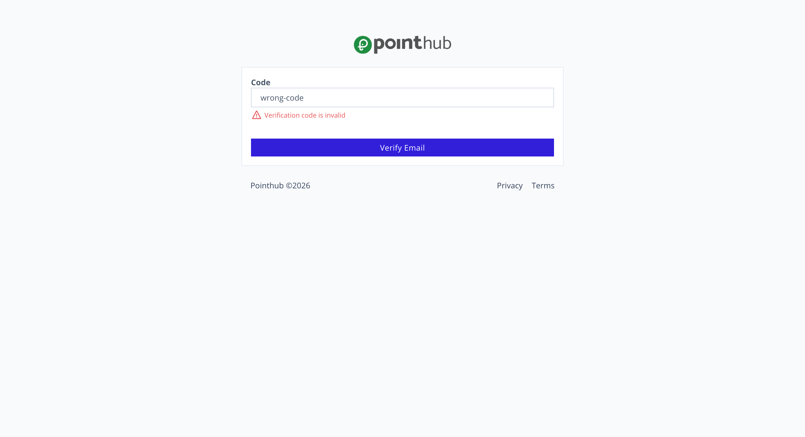

# Scenario 1.2. Verify Email

## Scenarios

- **Success Scenarios**
  - [1.2.S1. User successfully signup.](/auth/verify-email/scenarios/s1)
- **Failure Scenarios**
  - [1.2.F1. The required fields is empty.](/auth/verify-email/scenarios/f1)
  - [**1.2.F2. The verification code is invalid.**](/auth/verify-email/scenarios/f2)

## 1.2.F1. The required fields is empty.

- `GIVEN` user visit verify email page
- `WHEN` user click "Verify Email" button
- `THEN` user see "Verification code is invalid."

{.shadow-img}
