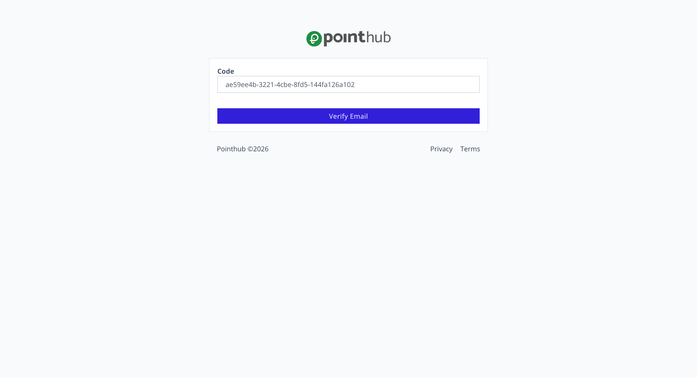
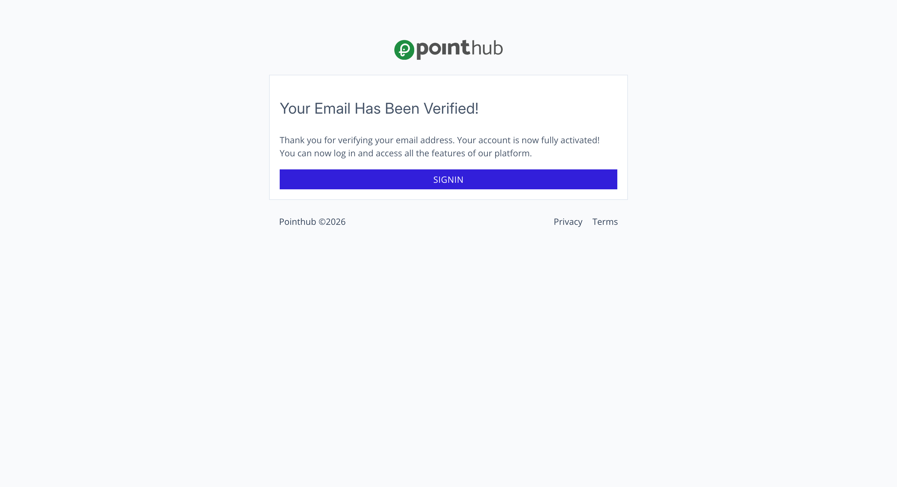

# Scenario 1.2. Verify Email

## Scenarios

- **Success Scenarios**
  - [**1.2.S1. User successfully signup.**](/auth/verify-email/scenarios/s1)
- **Failure Scenarios**
  - [1.2.F1. The required fields is empty.](/auth/verify-email/scenarios/f1)
  - [1.2.F2. The verification code is invalid.](/auth/verify-email/scenarios/f2)

## 1.2.S1. User successfully verify email

- `GIVEN` user already filled signup form

```ts
const users = [
  {
    _id: "69ae0dabf12cfd6a5dd090eb",
    username: "johndoe",
    email: "johndoe@example.com",
    password: "$argon2id$v=19$m=65536,t=2,p=1$7M8Lw...",
    email_verification: {
      is_verified: false,
      requested_at: "2026-03-09T00:00:42.734Z",
      code: "ae59ee4b-3221-4cbe-8fd5-144fa126a102",
      url: "https://simple-accounting.pointhub.app/verify-email"
    },
    created_at: "2026-03-09T00:00:43.411Z",
    trimmed_email: "johndoe@example.com",
    trimmed_username: "johndoe"
  }
]
```

- `AND` user already receive verify email code from email

{.shadow-img}

- `AND` user visit verify email page
- `WHEN` user click "Verify Email" button

{.shadow-img}

- `THEN` user see "Your Email Has Been Verified!"

{.shadow-img}

## Database Changes

Before Signup

```ts
const users = [
  {
    _id: "69ae0dabf12cfd6a5dd090eb",
    ...
    email_verification: {
      is_verified: false,
      requested_at: "2026-03-09T00:00:42.734Z",
      code: "ae59ee4b-3221-4cbe-8fd5-144fa126a102",
      url: "https://simple-accounting.pointhub.app/verify-email"
    },
    ...
  }
]
```

After Signup

```ts
const users = [
  {
    _id: "69ae0dabf12cfd6a5dd090eb",
    ...
    email_verification: {
      is_verified: true,
      verified_at: "2026-03-09T00:00:50.734Z",
    },
    ...
  }
]
```