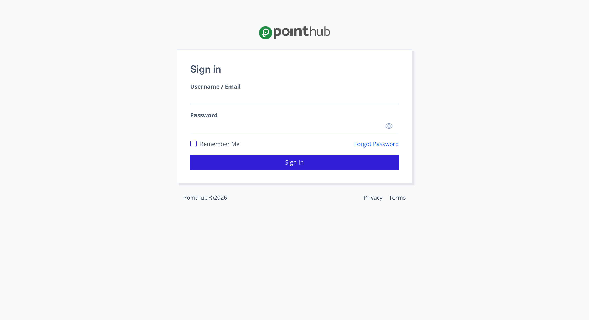

# Scenario 3.1. Import Chart of Account

## 3.1.F1. COA import fails when user is not authenticated.

- `GIVEN` user visit `/chart-of-accounts/import` url without signin
- `THEN` user redirected to `Sign In` page

{.shadow-img}