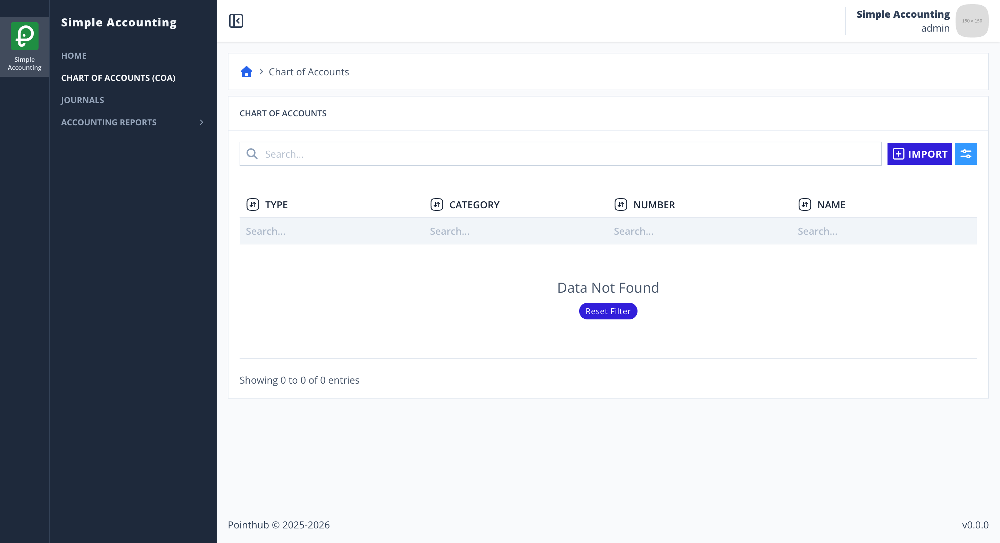
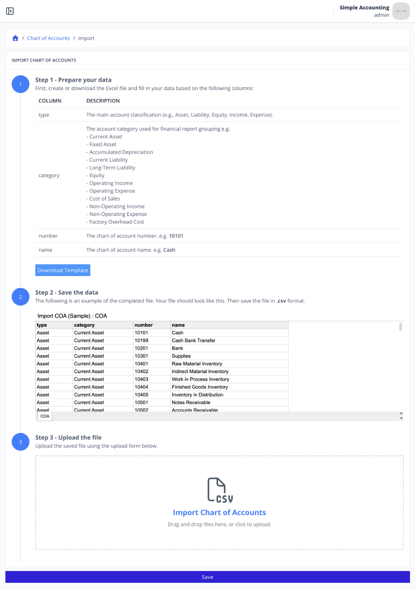
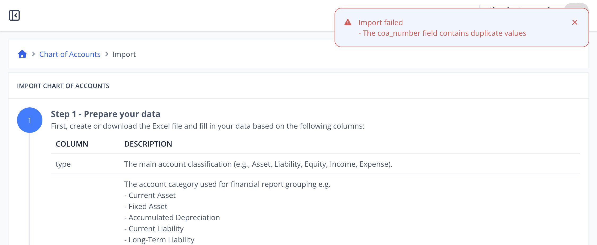

# Scenario 3.1. Import Chart of Account

## Scenarios

- **Success Scenarios**
  - [3.1.S1. User successfully import COA.](/chart-of-accounts/import/scenarios/s1)
- **Failure Scenarios**
  - [3.1.F1. User isn't authenticated.](/chart-of-accounts/import/scenarios/f1)
  - [3.1.F2. The required fields is empty.](/chart-of-accounts/import/scenarios/f2)
  - [**3.1.F3. The coa_number is already exists.**](/chart-of-accounts/import/scenarios/f3)
  - [3.1.F4. The coa_name is already exists.](/chart-of-accounts/import/scenarios/f4)

## 3.1.F3. The coa_number is already exists.

- `GIVEN` user already logged in
- `AND` user visit home
- `WHEN` user click menu "Chart of Accounts"

{.shadow-img}

- `WHEN` user click button "import"

{.shadow-img}

- `WHEN` user click "Download Template" button (step 1)
- `AND` user update their data to that csv (step 2)
- `AND` user upload the completed file (step 3)

{.shadow-img}

- `WHEN` user click "Save" button
- `THEN` user see notification "Import failed"
- `AND` user see notification "The coa_number field contains duplicate values"

{.shadow-img}