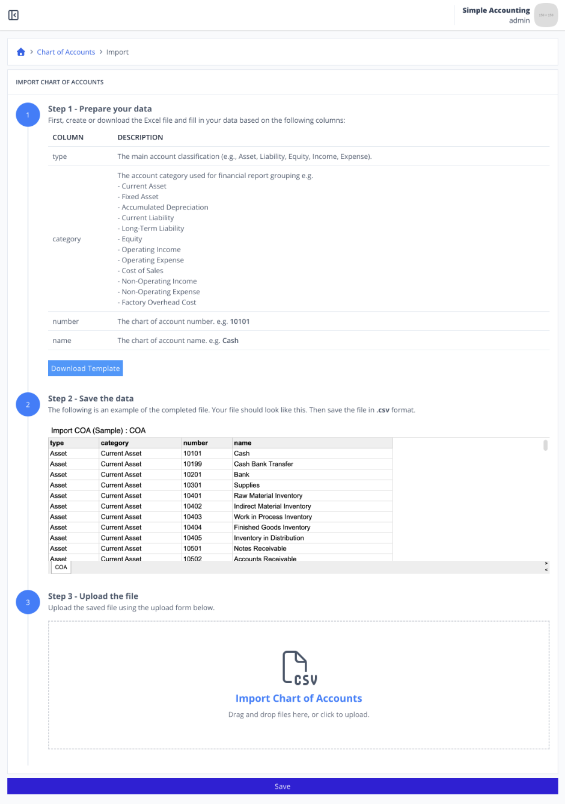
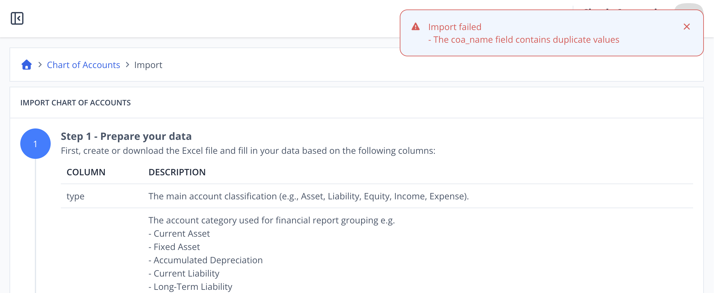

# Scenario 3.1. Import Chart of Account

## 3.1.F4. COA import fails when COA name already exists.

- `GIVEN` user already logged in
- `AND` user visit home
- `WHEN` user click menu "Chart of Accounts"

{.shadow-img}

- `WHEN` user click button "import"

{.shadow-img}

- `WHEN` user click "Download Template" button (step 1)
- `AND` user update their data to that csv (step 2)
- `AND` user upload the completed file (step 3)

{.shadow-img}

- `WHEN` user click "Save" button
- `THEN` user see notification "Import failed"
- `AND` user see notification "The coa_name field contains duplicate values"

{.shadow-img}