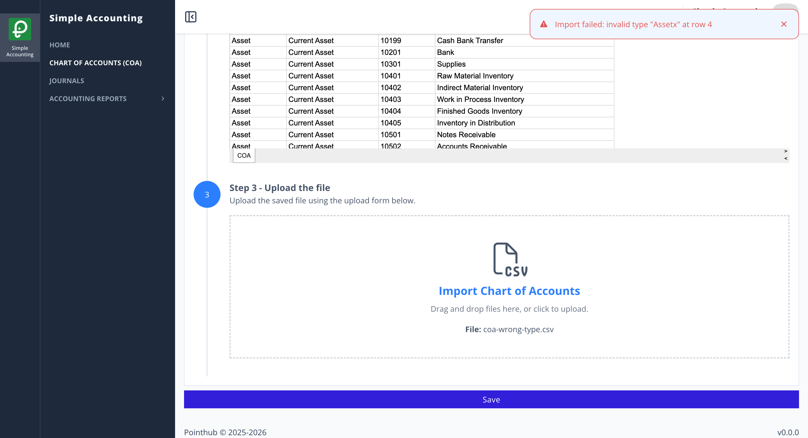

# Scenario 3.1. Import Chart of Account

## 3.1.F5. COA import fails when COA type is invalid.

- `GIVEN` user already logged in
- `AND` user visit home
- `WHEN` user click menu "Chart of Accounts"

{.shadow-img}

- `WHEN` user click button "import"

{.shadow-img}

- `WHEN` user click "Download Template" button (step 1)
- `AND` the user updates the CSV file (step 2), where row 4 intentionally contains an invalid COA type `Assetx` 

Ref: [ADR#004](/architecture-decision-records/004/)

<ClientOnly>
  <iframe style="width:100%;height:300px"  src="https://docs.google.com/spreadsheets/d/e/2PACX-1vS2oR69UQxpZ6Sq20C6uo2NrlGE6WtMVLqWTegBdKl-uH9l6kjE0t7v6_MCE1EL5es5NcdGbxyeDcq6/pubhtml?gid=156961744&amp;single=true&amp;widget=true&amp;headers=false"></iframe>
</ClientOnly>

- `WHEN` user upload the completed file (step 3)

{.shadow-img}

- `WHEN` user click "Save" button
- `THEN` user see notification "Import failed: invalid type "Assetx" at row 4"

{.shadow-img}