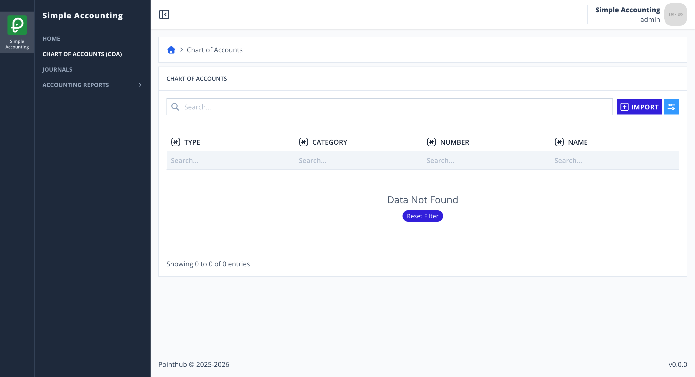
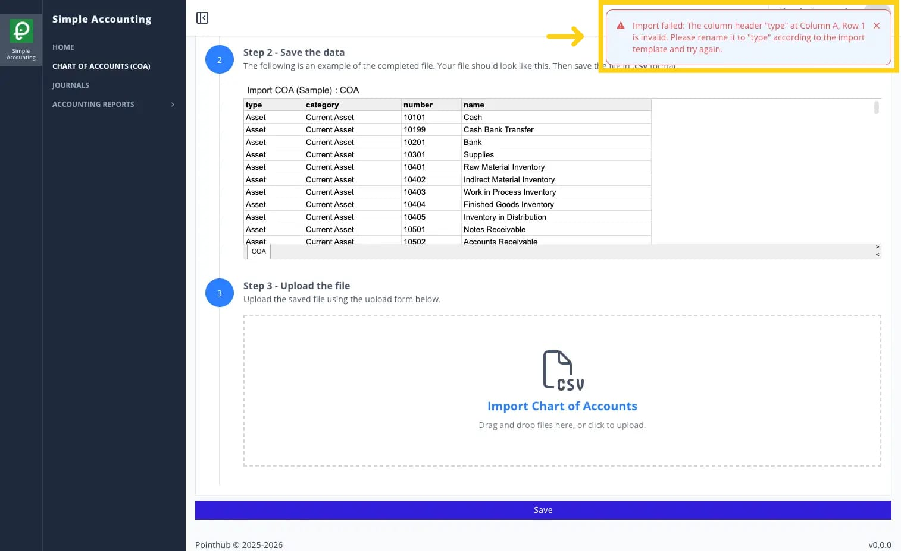

# Scenario 3.1. Import Chart of Account

Reference: [ADR#005](/architecture-decision-records/005/)

## 3.1.F8. COA import fails when the headers are invalid.

- `GIVEN` user already logged in
- `AND` user visit home
- `WHEN` user click menu "Chart of Accounts"

{.shadow-img}

- `WHEN` user click button "import"

{.shadow-img}

- `WHEN` user click "Download Template" button (step 1)
- `AND` user update their data to that csv (step 2)
- `AND` user upload the completed file (step 3)

{.shadow-img}

- `WHEN` user click "Save" button
- `THEN` user see notification "Import failed: The column header "type" at Column A, Row 1 is invalid. Please rename it to "type" according to the import template and try again."

{.shadow-img}