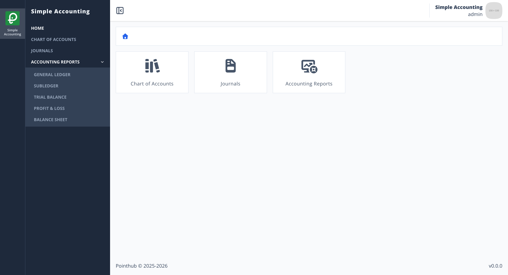
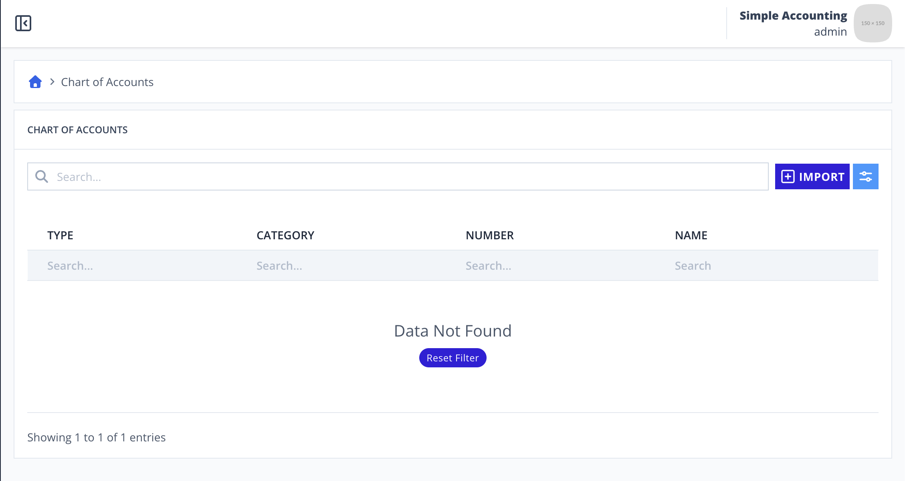
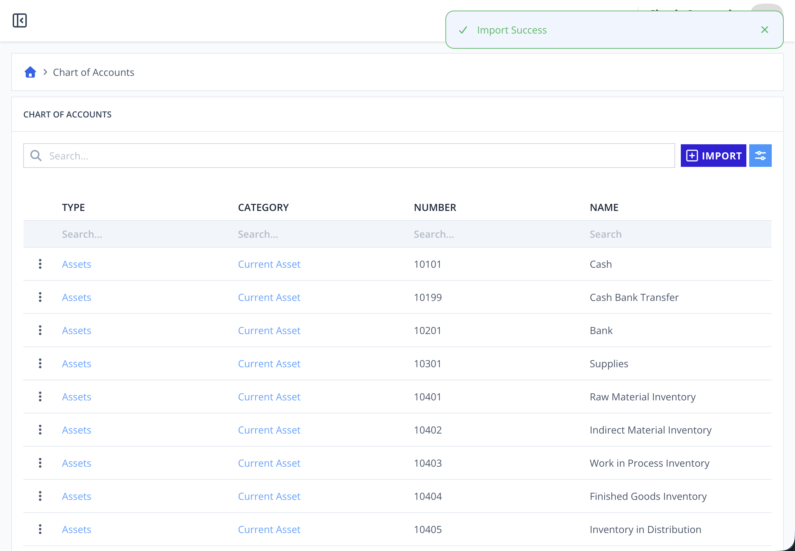

# Scenario 3.1. Import Chart of Account

## Scenarios

- **Success Scenarios**
  - [**1.1.S1. User successfully import COA.**](/chart-of-accounts/import/scenarios/s1)
- **Failure Scenarios**
  - [1.1.F1. The required fields is empty.](/chart-of-accounts/import/scenarios/f1)
  - [1.1.F2. The coa_number is already exists.](/chart-of-accounts/import/scenarios/f2)
  - [1.1.F3. The coa_name is already exists.](/chart-of-accounts/import/scenarios/f3)

## 1.1.S1. User successfully import COA.

- `GIVEN` user already logged in
- `AND` user visit home
- `WHEN` user click menu "chart-of-accounts"

{.shadow-img}

- `WHEN` user click button "import"
- `AND` user upload csv file

{.shadow-img}

- `THEN` user see notification "Import Success"
- `AND` user see imported file in the table

{.shadow-img}