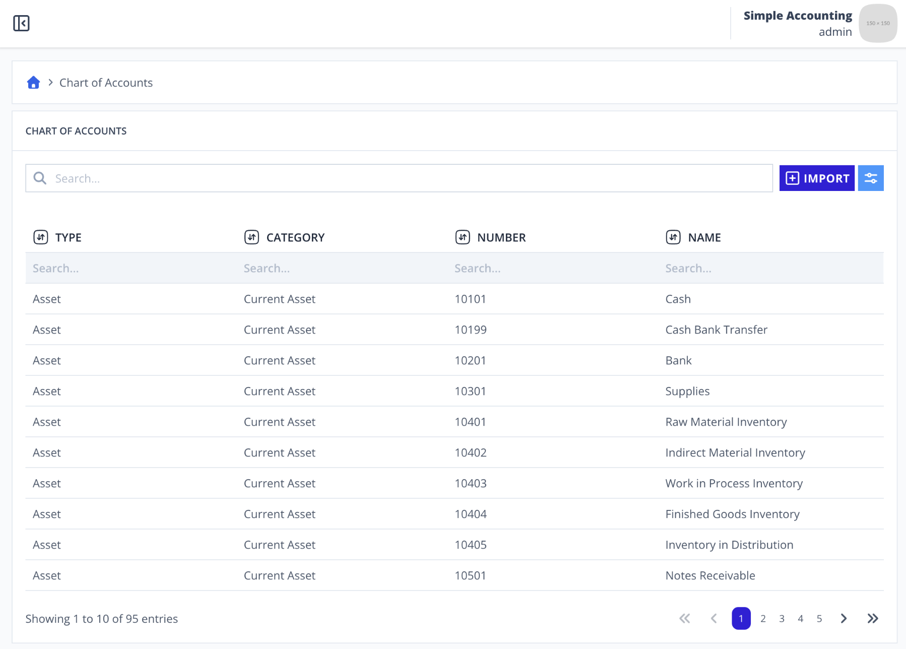

# Scenario 3.2. List Chart of Accounts

## Scenarios

- **Success Scenarios**
  - [**3.2.S1. Display paginated chart of accounts data.**](/chart-of-accounts/list/scenarios/s1)
- **Failure Scenarios**
  - [3.2.F1. User isn't authenticated.](/chart-of-accounts/list/scenarios/f1)

## 3.2.S1. Display paginated journals data.

- `GIVEN` user already logged in
- `AND` user visit home
- `WHEN` user click menu "Chart of Accounts"

{.shadow-img}

- `THEN` user see "TYPE" header
- `AND` user see "CATEGORY" header
- `AND` user see "NUMBER" header
- `AND` user see "NAME" header
- `AND` user see "Showing 1 to 10 of 95 entries"

{.shadow-img}