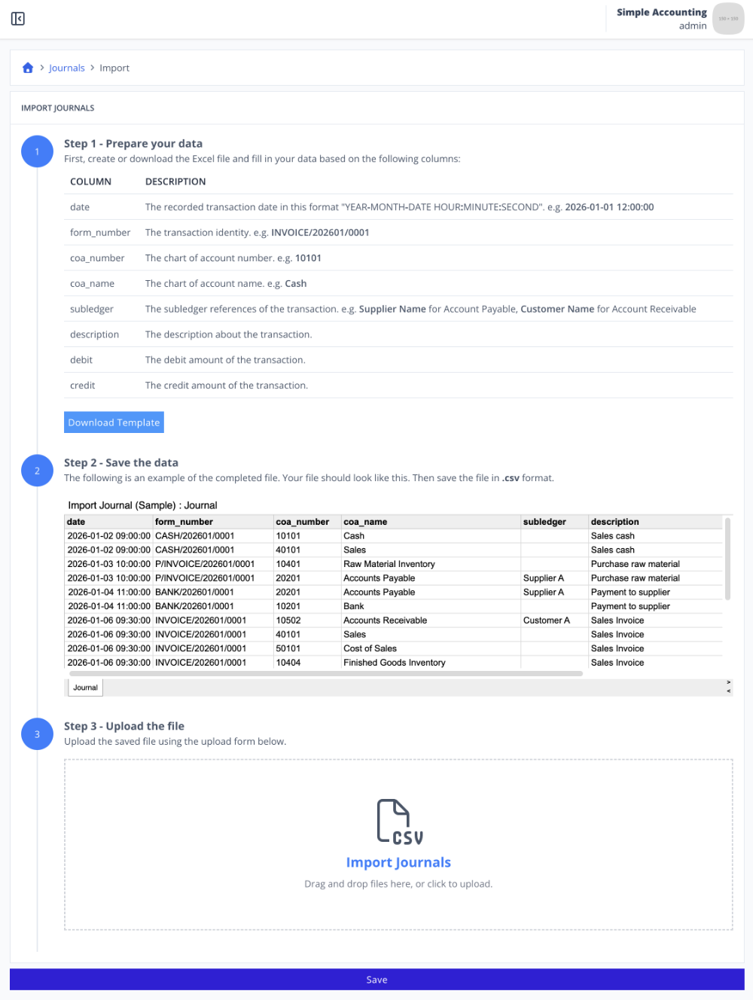
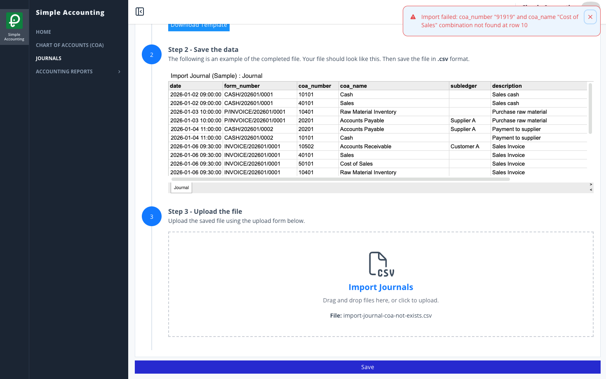

# Scenario 4.1. Import Journals

## 4.1.F3. Journal import fails when COA number or COA name does not match any record.

- `GIVEN` user already logged in
- `AND` user visit home
- `WHEN` user click menu "Journals"

{.shadow-img}

- `WHEN` user click button "import"

{.shadow-img}

- `WHEN` user click "Download Template" button (step 1)
- `AND` user update their data to that csv (step 2)

| date | form_number | coa_number | coa_name | subledger | description | Debit | Credit |
| --- | --- | --- | --- | --- | --- | --- | --- |
| 2026-01-06 09:30:00 | INVOICE/202601/0001 | 91919 | Cost of Sales |  | Sales Invoice | 2,500,000.00 | 0.00 |

::: info
At row 10, the user entered coa_number = 91919, which does not exist in the master COA.
:::

- `AND` user upload the completed file (step 3)

{.shadow-img}

- `WHEN` user click "Save" button
- `THEN` user see notification "Import failed."
- `AND` user see notification "Import failed: coa_number "91919" and coa_name "Cost of Sales" combination not found at row 10"

{.shadow-img}