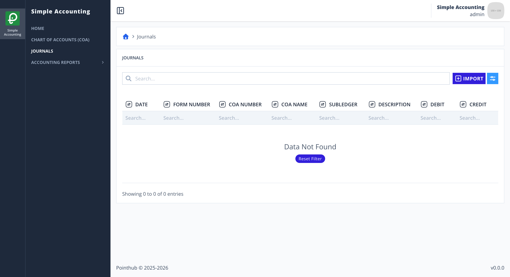
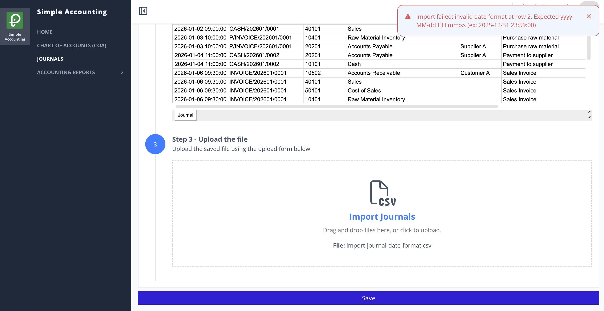

# Scenario 4.1. Import Journals

## 4.1.F5. Journal import fails when the date format is invalid.

- `GIVEN` user already logged in
- `AND` user visit home
- `WHEN` user click menu "Journals"

{.shadow-img}

- `WHEN` user click button "import"

{.shadow-img}

- `WHEN` user click "Download Template" button (step 1)
- `AND` user update their data to that csv (step 2)
- `AND` user upload the completed file (step 3)

{.shadow-img}

- `WHEN` user click "Save" button
- `THEN` user see notification "Import failed: invalid date format at row 2. Expected yyyy-MM-dd HH:mm:ss (ex: 2025-12-31 23:59:00)."

{.shadow-img}