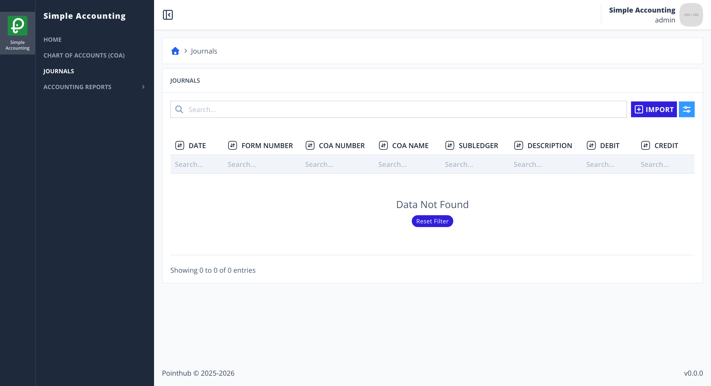
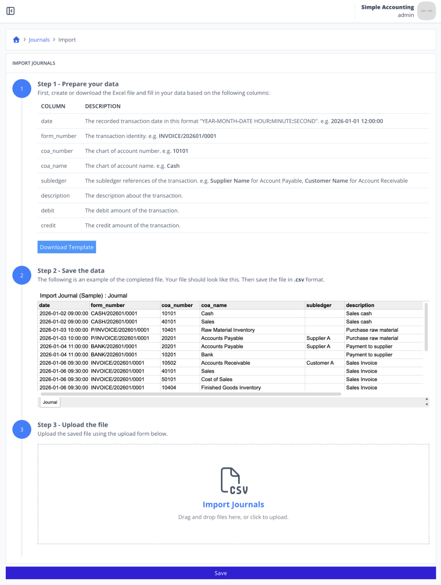
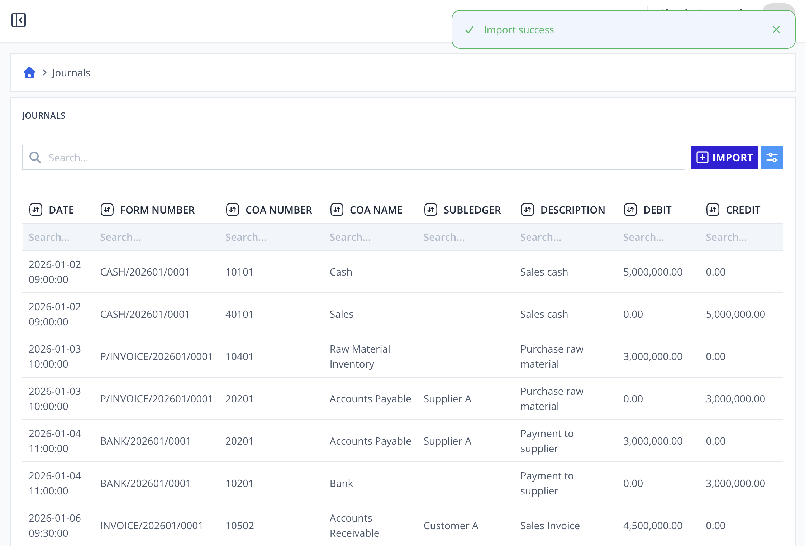

# Scenario 4.1. Import Journals

## Scenarios

- **Success Scenarios**
  - [**4.1.S1. User successfully import Journals.**](/journals/import/scenarios/s1)
- **Failure Scenarios**
  - [4.1.F1. User isn't authenticated.](/journals/import/scenarios/f1)
  - [4.1.F2. The required fields is empty.](/journals/import/scenarios/f2)
  - [4.1.F3. The coa_number and coa_name do not match any record in the Chart of Accounts.](/journals/import/scenarios/f3)
  - [4.1.F4. The journal debit and credit amounts are not balanced.](/journals/import/scenarios/f4)

## 4.1.S1. User successfully import Journals.

- `GIVEN` user already logged in
- `AND` user visit home
- `WHEN` user click menu "Journals"

{.shadow-img}

- `WHEN` user click button "import"

{.shadow-img}

- `WHEN` user click "Download Template" button (step 1)
- `AND` user update their data to that csv (step 2)
- `AND` user upload the completed file (step 3)

{.shadow-img}

- `WHEN` user click "Save" button
- `THEN` user redirected to "Journals - List" page
- `AND` user see notification "Import success"
- `AND` user see the data imported

{.shadow-img}