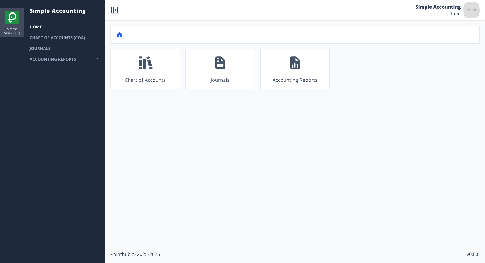
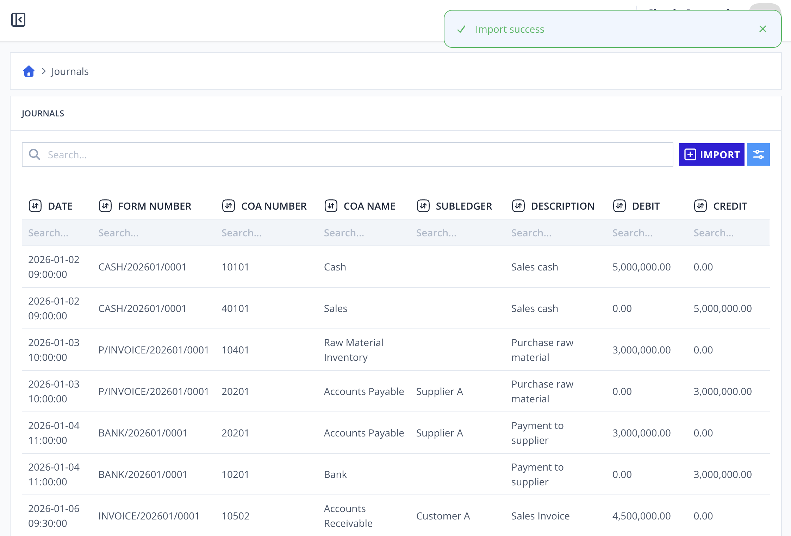

# Scenario 4.1. Import Journals

## 4.1.S1. User can import journals successfully.

- `GIVEN` user already logged in
- `AND` user visit home
- `WHEN` user click menu "Journals"

{.shadow-img}

- `WHEN` user click button "import"

{.shadow-img}

- `WHEN` user click "Download Template" button (step 1)
- `AND` user update their data to that csv (step 2)
- `AND` user upload the completed file (step 3)

{.shadow-img}

- `WHEN` user click "Save" button
- `THEN` user redirected to "Journals - List" page
- `AND` user see notification "Import success"
- `AND` user see the data imported

{.shadow-img}