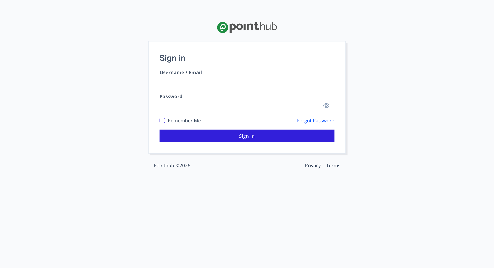

# Scenario 4.2. List Journals

## Scenarios

- **Success Scenarios**
  - [4.2.S1. Display paginated journals data.](/journals/list/scenarios/s1)
- **Failure Scenarios**
  - [4.2.F1. User isn't authenticated.](/journals/list/scenarios/f1)

## 4.2.F1. User isn't authenticated.

- `GIVEN` user visit `/journals` url without signin
- `THEN` user redirected to `Sign In` page

{.shadow-img}