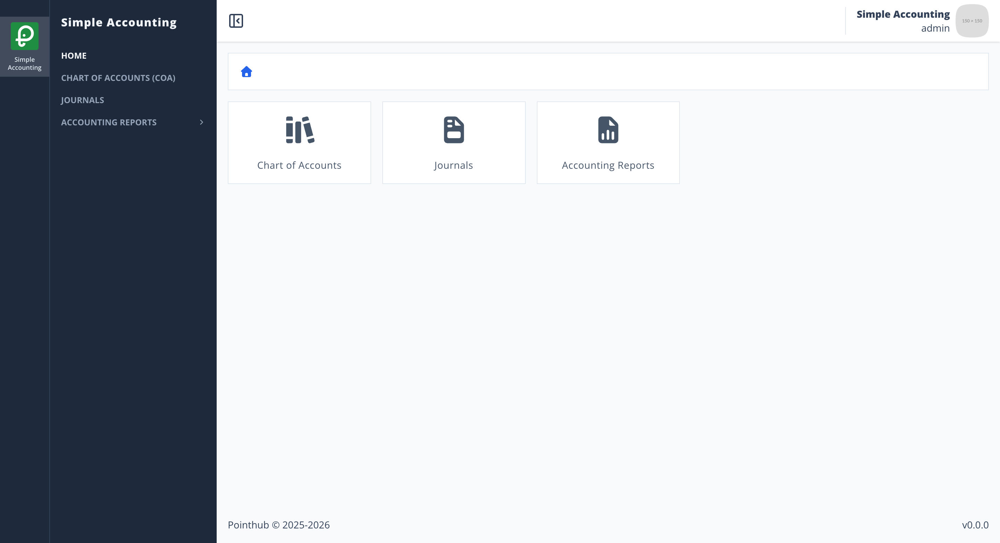
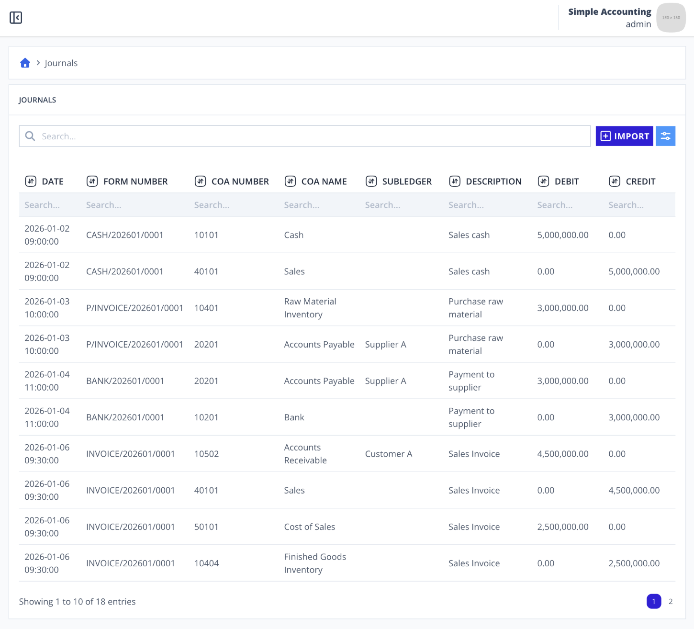

# Scenario 4.2. List Journals

## Scenarios

- **Success Scenarios**
  - [**4.2.S1. Display paginated journals data.**](/journals/list/scenarios/s1)
- **Failure Scenarios**
  - [4.2.F1. User isn't authenticated.](/journals/list/scenarios/f1)

## 4.2.S1. Display paginated journals data.

- `GIVEN` user already logged in
- `AND` user visit home
- `WHEN` user click menu "Journals"

{.shadow-img}

- `THEN` user see "DATE" header
- `AND` user see "FORM NUMBER" header
- `AND` user see "COA NUMBER" header
- `AND` user see "COA NAME" header
- `AND` user see "SUBLEDGER" header
- `AND` user see "DESCRIPTION" header
- `AND` user see "DEBIT" header
- `AND` user see "CREDIT" header
- `AND` user see "Showing 1 to 10 of 18 entries"

{.shadow-img}